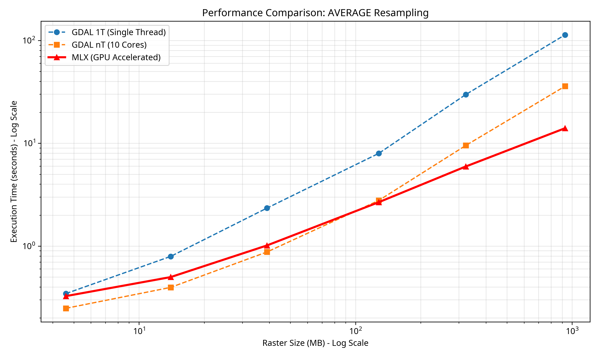

# MLX-Cog-Gen


[](#)

MLX-accelerated Cloud Optimized GeoTIFF generator for Apple Silicon.

## About

- Replaces GDAL's CPU-based pyramid/overview generation with an MLX GPU implementation on Apple Silicon
- Everything else in the COG pipeline (tiling, compression, metadata) stays with GDAL
- **GDAL is a required system dependency** (links against the installed library; not bundled)

## Why Apple Silicon

- On x86, GPU availability varies; GDAL never uses a GPU for overviews either way
- Every M-series Mac has a high-performance GPU in the same package as the CPU (shared memory)
- GDAL leaves that GPU idle for the entire overview step
- Optimising for Apple Silicon benefits all M-series machines, not a subset with discrete GPUs

## Resampling methods

GDAL's default overview resampling is **NEAREST**:

- Picks one pixel from each 2×2 block and discards the rest
- Throws away 75% of the signal per level on continuous data
- Narrow features (e.g. a one-pixel ridge) can vanish at coarser levels

`mlx_translate` supports two methods that avoid this.

### AVERAGE (default)

- Every pixel in a 2×2 block contributes equally:

```
out[i,j] = (src[2i,2j] + src[2i,2j+1] + src[2i+1,2j] + src[2i+1,2j+1]) / count_valid
```

- Box filter; preserves signal energy across zoom levels
- Standard choice for continuous rasters in geospatial workflows
- Maps directly onto GPU array ops with no approximation

### BILINEAR

- Treats each output pixel as a point sample, not a fixed block average
- Sample position for output pixel `i` in source space:

```
x = (i + 0.5) * 2 - 0.5 = 2i + 0.5
```

- Lands halfway between source pixels `2i` and `2i+1`
- Tent filter (`w = 1 - |distance|`) assigns weight 0.5 to each neighbour
- Two 1D passes (horizontal, then vertical); matches GDAL's separable bilinear
- At 2× interior pixels, numerically the same as AVERAGE; model differs (interpolation vs integration)
- Most common alternative to AVERAGE; cubic/lanczos are higher-order and not defaults

## Limitations

- **Float32 only**
  - Input bands must be Float32; other dtypes are rejected at the CLI
  - In scope: continuous elevation/analytic products (DSM, DTM, DEM, slope, aspect, similar)
  - Out of scope: Byte orthos, UInt16 imagery, Float16, integer elevation encodings, categorical maps
  - Use `gdal_translate` for non-Float32
- **Memory**
  - Each band is loaded fully into unified memory before GPU dispatch
  - Uncompressed raster must fit in available system memory
  - Size estimate: `width × height × bands × bytes_per_pixel`
  - Example: Float32 single-band 30000×30000 ≈ 3.4 GB
  - GDAL strips large rasters; if input will not fit, use `gdal_translate`

## Build

Install dependencies:

```bash
brew install gdal cmake mlx
```

Build and test:

```bash
mkdir build && cd build
cmake .. -DCMAKE_PREFIX_PATH=/opt/homebrew
make
ctest --output-on-failure
```

## Usage

```bash
build/mlx_translate input.tif output_cog.tif
```

- Default: COG with LZW compression and AVERAGE resampling
- `-r` selects resampling; `-co KEY=VALUE` overrides creation options

```bash
build/mlx_translate input.tif output_cog.tif -r BILINEAR
build/mlx_translate input.tif output_cog.tif -r AVERAGE -co COMPRESS=DEFLATE
```

- Supported resampling: `AVERAGE` (default), `BILINEAR`

## Benchmarks

- Hardware: M1 Pro (16 GB)
- 5 runs per method
- Float32 single-band DEMs via TIN interpolation at six GSDs
- GDAL 1T: single-threaded default
- GDAL nT: `ALL_CPUS` (10 cores)
- MLX: parallel LZW tile compression (`GDAL_NUM_THREADS=ALL_CPUS`) on final COG write

**AVERAGE**

| Raster | Dimensions | File size | GDAL 1T | GDAL nT | MLX | vs GDAL 1T | vs GDAL nT |
|---|---|---|---|---|---|---|---|
| dem_160cm | 1873×1817 | 4.6 MB | 0.345s | 0.248s | 0.325s | 1.06× faster | 1.31× slower |
| dem_80cm | 3746×3634 | 14 MB | 0.788s | 0.393s | 0.494s | 1.60× faster | 1.26× slower |
| dem_40cm | 7491×7268 | 39 MB | 2.310s | 0.871s | 0.999s | 2.31× faster | 1.15× slower |
| dem_20cm | 14982×14536 | 128 MB | 7.962s | 2.780s | 2.646s | 3.01× faster | 1.05× faster |
| dem_10cm | 29967×29074 | 323 MB | 29.309s | 9.432s | 5.130s | 5.71× faster | 1.84× faster |
| dem_5cm | 59927×58141 | 928 MB | 112.418s† | 35.555s | 13.012s | 8.64× faster | 2.73× faster |

**BILINEAR**

| Raster | Dimensions | File size | GDAL 1T | GDAL nT | MLX | vs GDAL 1T | vs GDAL nT |
|---|---|---|---|---|---|---|---|
| dem_160cm | 1873×1817 | 4.6 MB | 0.349s | 0.248s | 0.325s | 1.07× faster | 1.31× slower |
| dem_80cm | 3746×3634 | 14 MB | 0.831s | 0.403s | 0.491s | 1.69× faster | 1.22× slower |
| dem_40cm | 7491×7268 | 39 MB | 2.442s | 0.903s | 0.994s | 2.46× faster | 1.10× slower |
| dem_20cm | 14982×14536 | 128 MB | 8.798s | 2.880s | 2.652s | 3.32× faster | 1.09× faster |
| dem_10cm | 29967×29074 | 323 MB | 32.968s‡ | 9.815s | 4.979s | 6.62× faster | 1.97× faster |
| dem_5cm | 59927×58141 | 928 MB | 126.848s | 36.882s‡ | 13.055s | 9.72× faster | 2.83× faster |

- † 1 of 5 runs excluded (144.8s outlier); average from 4 valid runs
- ‡ dem_10cm GDAL 1T: 1 of 5 runs excluded (293.9s outlier). dem_5cm GDAL nT: 1 of 5 runs excluded (57.4s outlier)

| AVERAGE | BILINEAR |
|---|---|
|  |  |

- MLX beats GDAL nT from dem_20cm (128 MB) upward
- At dem_5cm (~60k×58k): **2.73×** (AVERAGE), **2.83×** (BILINEAR) vs GDAL nT
- Below ~128 MB, Metal launch overhead can make MLX slower than GDAL nT
- MLX AVERAGE and BILINEAR wall times are nearly identical (GPU parallelises both uniformly)

## Roadmap

- Additional resampling algorithms (cubic, lanczos)
- GPU-accelerated statistics (min, max, mean, stddev) across overview levels
- GPU-accelerated tile block creation (512×512; currently delegated to GDAL)
- OOM detection and graceful fallback to GDAL

## Contributing

- Open an issue before raising a PR
- Describe what you want to do and why
- Open the PR once the approach is agreed

## License

[MIT](https://choosealicense.com/licenses/mit/)
